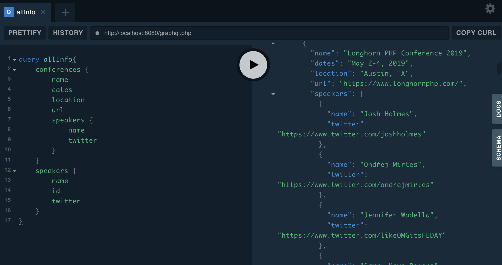
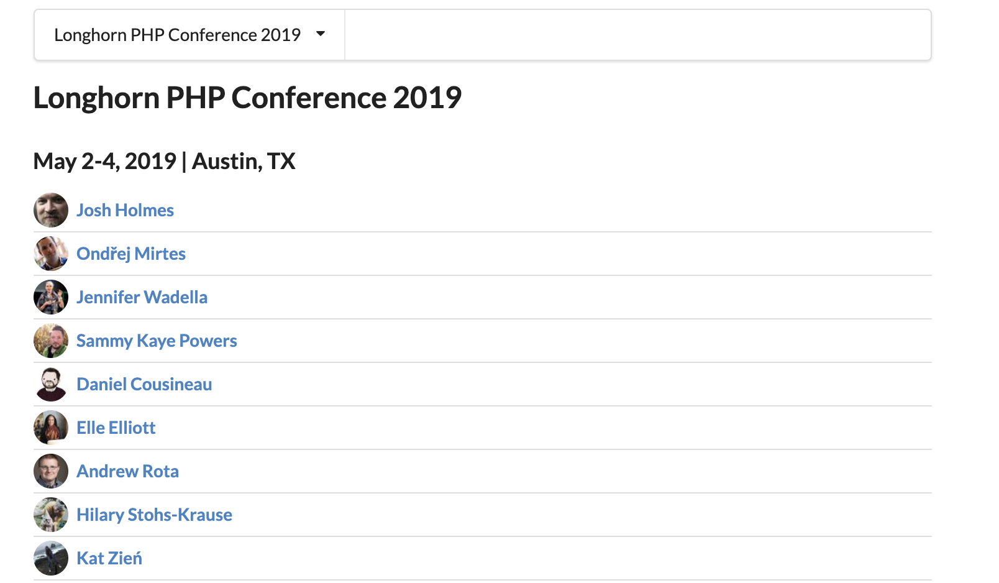
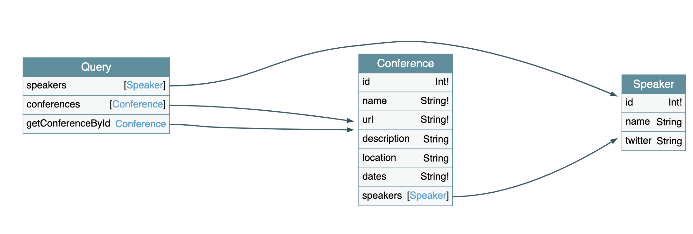
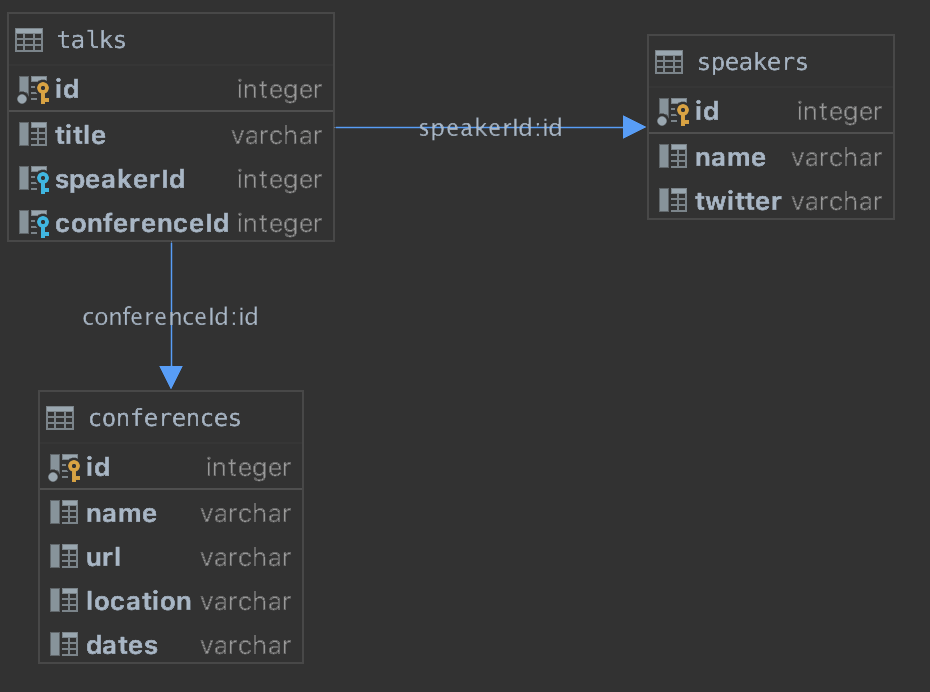

## LonghornPHP 2019 GraphQL Tutorial

This is the example application for the [Build a GraphQL API with PHP tutorial](https://www.longhornphp.com/sessions/#build-a-graphql-api-with-php-tutorial) at the [Longhorn PHP 2019 Conference](https://www.longhornphp.com/).

### Branches

* `master` branch is meant to be the starting point for the tutorial, and so most functionality initially will not work.
* `complete` branch is the completed application, available for reference

### Objective

The objective of this tutorial is to build a simple GraphQL API that displays a sample selection of PHP conferences with associated speakers.




### Schema

The eventual GraphQL schema will look like this:

```graphql schema
type Query {
  message(name: String): String
  speakers: [Speaker]
  conferences(nameFilter: String): [Conference]
  getConferenceById(id: Int): Conference
}


type Mutation {
  addSpeaker(name: String!, twitter: String): CreateSpeakerOutput
}

type Conference {
  id: Int!
  name: String!
  url: String!
  description: String
  location: String
  dates: String!
  speakers: [Speaker]
}

type Speaker {
  id: Int!
  name: String
  twitter: String
}

type CreateSpeakerOutput {
  id: Int
}

```



The underlying data is stored in a sqlite databse (`phpconferences.sqlite`) and looks like this: 



